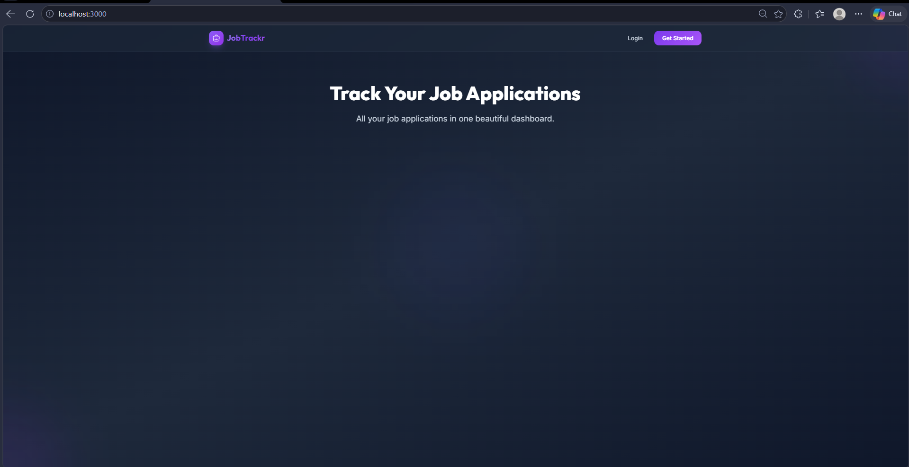
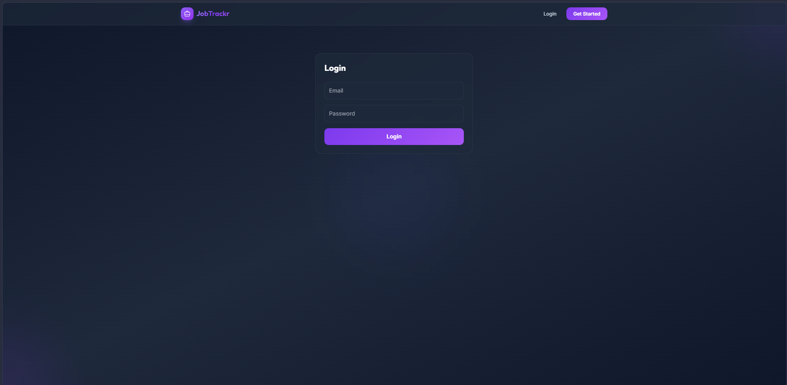
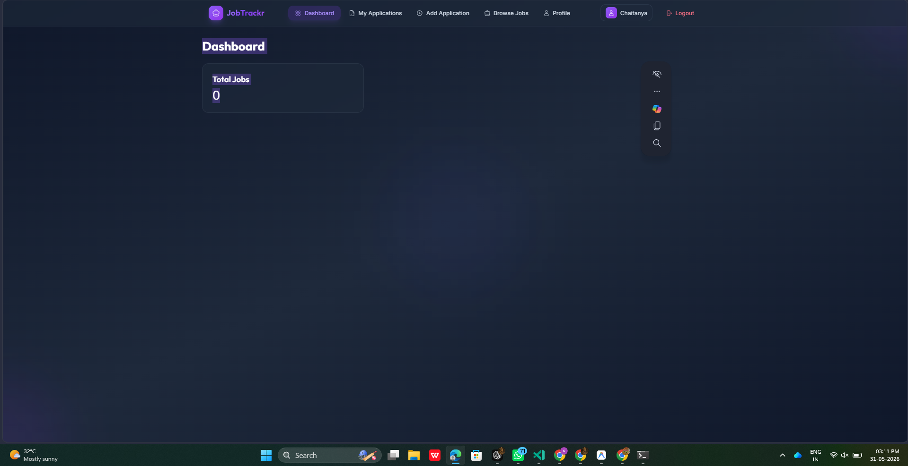
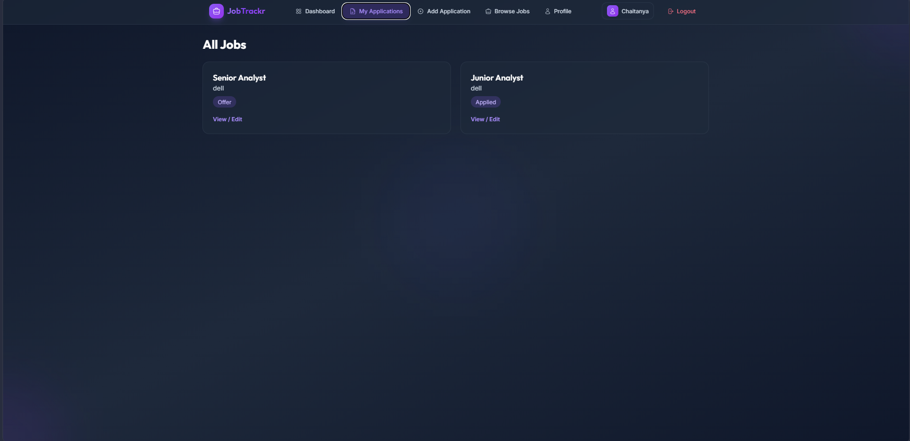
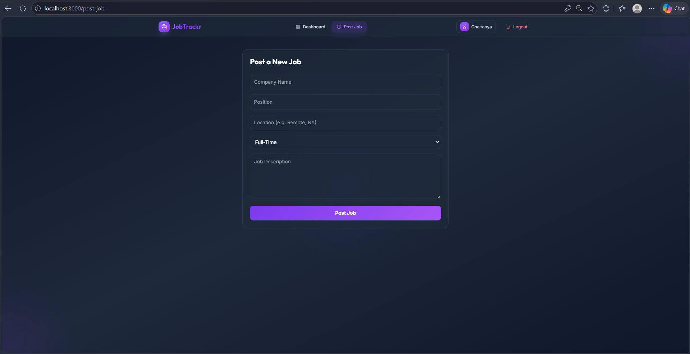
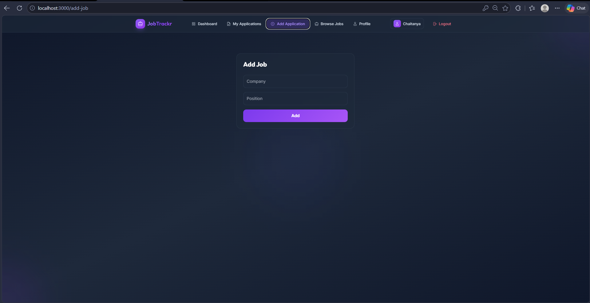
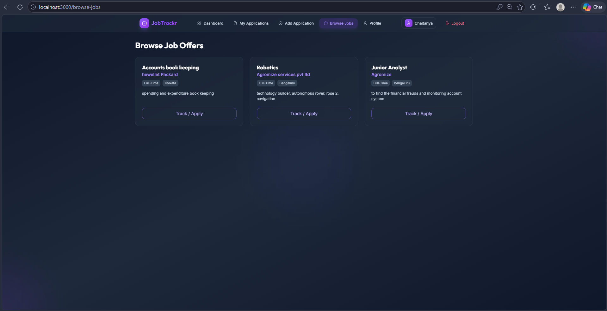
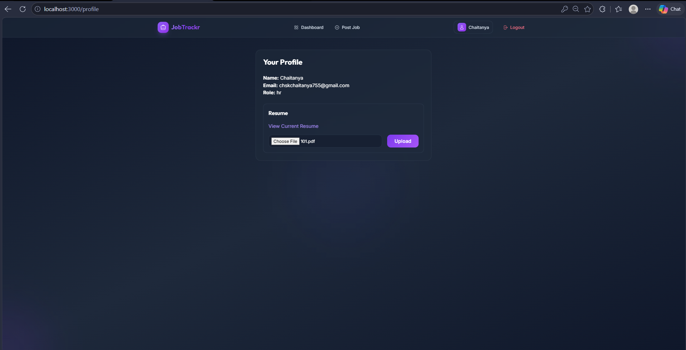

# 🚀 JobTrackr — Job Application Tracker Portal

<div align="center">


[](https://reactjs.org/)
[](https://nodejs.org/)
[](https://expressjs.com/)
[](https://www.mongodb.com/)
[](https://tailwindcss.com/)
[](https://jwt.io/)

**A full-stack MERN application to track, manage, and analyze your job applications — all in one beautiful dashboard.**

[Features](#-features) · [Tech Stack](#-tech-stack) · [Architecture](#-architecture) · [Installation](#-installation) · [API Docs](#-api-endpoints) · [Screenshots](#-screenshots)

</div>

---

## 📋 Table of Contents

- [Problem Statement](#-problem-statement)
- [Features](#-features)
- [Tech Stack](#-tech-stack)
- [Architecture](#-architecture)
- [Folder Structure](#-folder-structure)
- [Installation](#-installation)
- [Environment Variables](#-environment-variables)
- [Running the Project](#-running-the-project)
- [API Endpoints](#-api-endpoints)
- [Screenshots](#-screenshots)
- [Learning Outcomes](#-learning-outcomes)
- [Contributing](#-contributing)
- [License](#-license)

---

## ❓ Problem Statement

Job seekers often apply to **dozens or even hundreds of positions** across different companies. Without a centralized tracking system, it becomes nearly impossible to:

- Remember which companies you've applied to
- Track which stage each application is at (Applied → Interview → Offer → Rejected)
- Follow up on pending applications
- Keep notes about each opportunity
- Analyze your job search progress

**JobTrackr solves this** by providing a beautiful, intuitive dashboard where users can:
- Add and manage all job applications in one place
- Track status changes with color-coded badges
- View statistics and charts about their job search
- Filter and search through applications
- Never miss an interview date or deadline

---

## ✨ Features

| Feature | Description |
|---------|-------------|
| 🔐 **User Authentication** | Secure JWT-based register/login system with password hashing |
| 📝 **CRUD Operations** | Create, Read, Update, Delete job applications |
| 📊 **Dashboard Analytics** | Visual statistics with charts showing application distribution |
| 🔍 **Search & Filter** | Filter by status, job type; search by company/position |
| 📱 **Responsive Design** | Works flawlessly on desktop, tablet, and mobile |
| 🎨 **Premium Dark UI** | Glassmorphic design with smooth animations |
| 🏷️ **Status Tracking** | Applied, Interview, Offer, Rejected — with color-coded badges |
| 📅 **Date Tracking** | Application and interview date management |
| 🔗 **Job Links** | Store job posting URLs for quick reference |
| 📝 **Notes** | Add personal notes to each application |
| ⚡ **Real-time Feedback** | Toast notifications for all actions |
| 🛡️ **Protected Routes** | Secure pages accessible only to authenticated users |

---

## 🛠️ Tech Stack

### Frontend
| Technology | Purpose |
|-----------|---------|
| **React 18** | UI component library with hooks |
| **Vite** | Next-gen frontend build tool |
| **Tailwind CSS 3** | Utility-first CSS framework |
| **React Router v6** | Client-side routing |
| **Axios** | HTTP client for API calls |
| **Recharts** | Chart library for dashboard |
| **React Icons** | Icon library |
| **React Hot Toast** | Toast notifications |

### Backend
| Technology | Purpose |
|-----------|---------|
| **Node.js 18+** | JavaScript runtime |
| **Express.js 4** | Web framework for REST APIs |
| **MongoDB** | NoSQL document database |
| **Mongoose 7** | MongoDB ODM with schema validation |
| **JWT** | Stateless authentication tokens |
| **bcryptjs** | Password hashing |
| **express-validator** | Server-side input validation |
| **cors** | Cross-Origin Resource Sharing |
| **dotenv** | Environment variable management |

---

## 🏗️ Architecture

```
┌─────────────────────────────────────────────────────────────┐
│                    CLIENT (React + Vite)                     │
│  ┌──────────┐ ┌──────────┐ ┌──────────┐ ┌───────────────┐  │
│  │  Login   │ │ Register │ │Dashboard │ │ Add/Edit Job  │  │
│  └────┬─────┘ └────┬─────┘ └────┬─────┘ └──────┬────────┘  │
│       └─────────────┴────────────┴───────────────┘           │
│                          │ Axios HTTP Requests               │
└──────────────────────────┼───────────────────────────────────┘
                           │
                    ┌──────▼──────┐
                    │   REST API  │
                    │  (Port 5000)│
                    └──────┬──────┘
                           │
┌──────────────────────────┼───────────────────────────────────┐
│                    SERVER (Express.js)                        │
│  ┌──────────┐ ┌──────────┐ ┌────────────┐ ┌──────────────┐  │
│  │  Auth    │ │  Job     │ │ Middleware  │ │  Controllers │  │
│  │  Routes  │ │  Routes  │ │ (JWT,CORS)  │ │              │  │
│  └────┬─────┘ └────┬─────┘ └──────┬─────┘ └──────┬───────┘  │
│       └─────────────┴──────────────┴──────────────┘          │
│                          │ Mongoose ODM                      │
└──────────────────────────┼───────────────────────────────────┘
                           │
                    ┌──────▼──────┐
                    │  MongoDB    │
                    │  (Atlas)    │
                    └─────────────┘
```

---

## 📂 Folder Structure

```
Job-Application-Tracker-Portal/
│
├── client/                          # React Frontend
│   ├── public/                      # Static assets
│   ├── src/
│   │   ├── components/              # Reusable UI components
│   │   │   ├── Navbar.jsx
│   │   │   ├── Layout.jsx
│   │   │   ├── JobCard.jsx
│   │   │   ├── StatsCard.jsx
│   │   │   ├── FilterBar.jsx
│   │   │   ├── JobForm.jsx
│   │   │   ├── ProtectedRoute.jsx
│   │   │   └── Loading.jsx
│   │   ├── pages/                   # Page components
│   │   │   ├── Landing.jsx
│   │   │   ├── Register.jsx
│   │   │   ├── Login.jsx
│   │   │   ├── Dashboard.jsx
│   │   │   ├── AllJobs.jsx
│   │   │   ├── AddJob.jsx
│   │   │   └── EditJob.jsx
│   │   ├── context/                 # React Context API
│   │   │   └── AuthContext.jsx
│   │   ├── utils/                   # Utilities
│   │   │   └── api.js
│   │   ├── App.jsx
│   │   ├── App.css
│   │   ├── index.css
│   │   └── main.jsx
│   ├── index.html
│   ├── tailwind.config.js
│   ├── postcss.config.js
│   ├── vite.config.js
│   └── package.json
│
├── server/                          # Express Backend
│   ├── config/
│   │   └── db.js                    # MongoDB connection
│   ├── controllers/
│   │   ├── authController.js        # Auth logic
│   │   └── jobController.js         # Job CRUD logic
│   ├── middleware/
│   │   ├── authMiddleware.js        # JWT verification
│   │   └── errorHandler.js          # Global error handler
│   ├── models/
│   │   ├── User.js                  # User schema
│   │   └── Job.js                   # Job application schema
│   ├── routes/
│   │   ├── authRoutes.js            # Auth endpoints
│   │   └── jobRoutes.js             # Job endpoints
│   ├── server.js                    # Entry point
│   ├── .env.example                 # Environment template
│   └── package.json
│
├── .gitignore                       # Git ignore rules
├── README.md                        # This file
└── docs/
    └── screenshots/                 # UI screenshots
```

---

## ⚙️ Installation

### Prerequisites

- **Node.js** 18+ → [Download](https://nodejs.org/)
- **MongoDB Atlas** account → [Sign up free](https://www.mongodb.com/cloud/atlas)
- **Git** → [Download](https://git-scm.com/)

### Step 1: Clone the Repository

```bash
git clone https://github.com/YOUR_USERNAME/Job-Application-Tracker-Portal.git
cd Job-Application-Tracker-Portal
```

### Step 2: Install Backend Dependencies

```bash
cd server
npm install
```

### Step 3: Install Frontend Dependencies

```bash
cd ../client
npm install
```

### Step 4: Setup Environment Variables

Create a `.env` file inside the `server/` directory:

```bash
cp server/.env.example server/.env
```

Then edit `server/.env` with your values (see next section).

---

## 🔐 Environment Variables

Create `server/.env` with the following:

```env
PORT=5000
MONGO_URI=mongodb+srv://<username>:<password>@cluster0.xxxxx.mongodb.net/jobtracker?retryWrites=true&w=majority
JWT_SECRET=your_super_secret_jwt_key_here_make_it_long_and_random
```

### How to get MongoDB Atlas URI:
1. Go to [MongoDB Atlas](https://www.mongodb.com/cloud/atlas)
2. Create a free cluster
3. Click "Connect" → "Connect your application"
4. Copy the connection string
5. Replace `<username>` and `<password>` with your credentials

> ⚠️ **NEVER commit your `.env` file to GitHub!** Use `.env.example` instead.

---

## 🚀 Running the Project

### Start Backend Server

```bash
cd server
npm run dev
```
Server runs on: `http://localhost:5000`

### Start Frontend Dev Server

```bash
cd client
npm run dev
```
Frontend runs on: `http://localhost:5173`

### Run Both Simultaneously

From the project root, you can use two terminal windows:
- Terminal 1: `cd server && npm run dev`
- Terminal 2: `cd client && npm run dev`

---

## 📡 API Endpoints

### Authentication

| Method | Endpoint | Description | Auth Required |
|--------|----------|-------------|:---:|
| `POST` | `/api/auth/register` | Register a new user | ❌ |
| `POST` | `/api/auth/login` | Login and get JWT token | ❌ |
| `GET` | `/api/auth/me` | Get current user profile | ✅ |

### Job Applications

| Method | Endpoint | Description | Auth Required |
|--------|----------|-------------|:---:|
| `GET` | `/api/jobs` | Get all jobs (paginated, filterable) | ✅ |
| `POST` | `/api/jobs` | Create a new job application | ✅ |
| `GET` | `/api/jobs/stats` | Get dashboard statistics | ✅ |
| `GET` | `/api/jobs/:id` | Get a single job by ID | ✅ |
| `PATCH` | `/api/jobs/:id` | Update a job application | ✅ |
| `DELETE` | `/api/jobs/:id` | Delete a job application | ✅ |

### Query Parameters for `GET /api/jobs`

| Parameter | Type | Description | Example |
|-----------|------|-------------|---------|
| `search` | String | Search by company or position | `?search=google` |
| `status` | String | Filter by status | `?status=Interview` |
| `jobType` | String | Filter by job type | `?jobType=Full-Time` |
| `sort` | String | Sort order | `?sort=newest` |
| `page` | Number | Page number | `?page=1` |
| `limit` | Number | Items per page | `?limit=10` |

---

## 📸 Screenshots

> Add your screenshots in the `docs/screenshots/` folder

| Page | Preview |
|------|---------|
| Landing Page |  |
| Register |    |
| Login |    |
| Dashboard |    |
| Add Job |    |
| All Jobs |    |
| Filter/Search |    |
| Mobile View |    |

---

## 📚 Learning Outcomes

By building this project, you will learn:

| Area | Skills |
|------|--------|
| **Frontend** | React hooks, Context API, routing, form handling, API integration |
| **Backend** | Express.js, REST API design, middleware pipeline, error handling |
| **Database** | MongoDB schema design, Mongoose ODM, aggregation pipelines |
| **Authentication** | JWT tokens, password hashing, protected routes |
| **UI/UX** | Tailwind CSS, responsive design, glassmorphism, micro-animations |
| **DevOps** | Environment variables, project structure, Git workflow |
| **Best Practices** | Code organization, error handling, input validation, security |

---

## 🤝 Contributing

Contributions are welcome! Please feel free to submit a Pull Request.

1. Fork the repository
2. Create your feature branch (`git checkout -b feature/AmazingFeature`)
3. Commit your changes (`git commit -m 'Add some AmazingFeature'`)
4. Push to the branch (`git push origin feature/AmazingFeature`)
5. Open a Pull Request

---

## 📄 License

This project is licensed under the MIT License - see the [LICENSE](LICENSE) file for details.

---

<div align="center">

**Built with ❤️ for Full Stack Development Portfolio**

⭐ Star this repo if you found it helpful!

</div>
